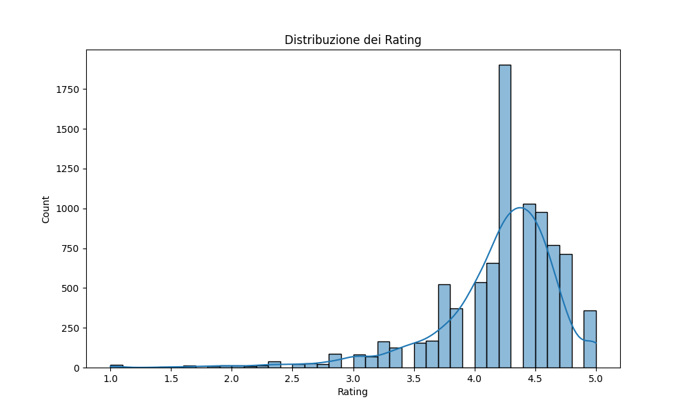
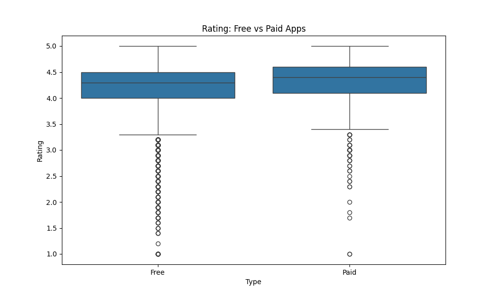

#  Google Play Store App Analysis

This project performs an **exploratory data analysis (EDA)** on a dataset from the Google Play Store to uncover key insights about user behavior, app popularity, pricing impact, and ratings. The analysis was conducted in Python and visualized using Matplotlib, Seaborn and Tableau.

---

##  Objectives

- Analyze the **distribution of app ratings**
- Compare **free vs paid** apps in terms of installs and ratings
- Investigate app **size trends** and download counts
- Visualize **category-wise popularity**
- Provide insights useful for **product launch strategies**

---

##  Tools & Technologies

- Python (Pandas, Matplotlib, Seaborn)
- Tableau (Data visualization)
- Google Colab (Notebook execution)
- Git & GitHub (Version control)

---

##  Project Structure

| File | Description |
|------|-------------|
| `Analisi_Comportamento_Sitiweb.ipynb` | Main Jupyter notebook with Python code |
| `googleplaystore.csv` | Original dataset |
| `rating_distribution.png` | Histogram of app ratings |
| `free_vs_paid_ratings.png` | Boxplot comparing free and paid apps |
| `top_categories_installs.png` | Bar chart of most installed app categories |
| *(optional)* `GooglePlay_Analysis.twbx` | Tableau packaged workbook |

---

##  Key Insights

- Over **80% of apps** are rated between **4 and 5**
- **Paid apps** tend to have slightly higher ratings on average
- Most apps are under **40MB**, but some outliers exceed **100MB**
- The most installed categories are:
  - `COMMUNICATION`
  - `SOCIAL`
  - `VIDEO_PLAYERS`

---

##  Sample Visualizations

---

##  How to Run

1. Open the notebook in [Google Colab](https://colab.research.google.com/) or your local Python environment
2. Make sure to have the dataset `googleplaystore.csv` in the same directory
3. Run the cells in order to reproduce the analysis
4. Visualizations can be explored directly in Tableau using the `.twbx` file

---

##  Ideal For

- Showcasing skills in **data analysis**
- Demonstrating knowledge of **user behavior modeling**
- Portfolio for roles in **data science**, **analytics**, or **product strategy**

---

> Created with passion by **Yassine** to explore user engagement and app trends on the Android platform.
